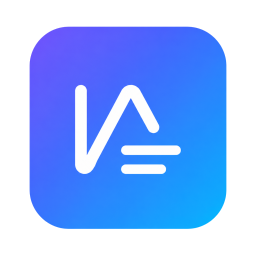

<div align="center">



# Note Agent

**A local-first desktop workspace where researchers and writers think alongside an agent.**

[](LICENSE)


[Why Note Agent](#why-note-agent) · [Quick start](#quick-start) · [Tools](#whats-in-the-toolbox) · [中文](#中文说明)

</div>

---

## Why Note Agent

Most AI tools are chat windows next to your files. Note Agent flips that: **your project is the workspace, and the agent works inside it.** A workspace is a folder; a task is a long-running chat session that knows about that folder. The agent reads your PDFs, searches arXiv, drafts your `.tex` and `.docx`, and remembers the project across days — all on disk, in plain files, with a SQLite index you control.

It's built for the two kinds of work where the model has to actually do something useful, not just chat:

- **Researchers** — index a folder of papers, search arXiv / Semantic Scholar / PubMed without leaving the editor, browse real web pages when an API will not do, and let the agent draft a literature review you can edit in Monaco.
- **Writers** — outline in one task, draft in another, keep a running revision log per chapter, and export to `.docx` / `.tex` / `.pptx` when you are done. The model proposes, you commit.

Everything is local-first: your notes are files on disk, your task history is in SQLite, and **your API keys belong to you** — bring an OpenAI, Anthropic, or any OpenAI-compatible endpoint (OpenRouter, Together, vLLM, a local Llama).

## Highlights

- **Task-session workspaces.** A workspace = a folder. A task = a persistent chat with its own mode, model overrides, and message history. Switch tasks without losing context.
- **Three permission modes.** `explore` (read-only), `ask` (prompt before any write or network mutation), `execute` (autonomous). Set per-task, change anytime.
- **Multi-provider, multi-tier routing.** Plan with Opus, execute with Sonnet, draft with Haiku — or stay on a single model. Configure a `ModelRouter` and the agent picks per round.
- **First-class web stack.** A `webSearch` that routes Wikipedia / Hacker News / Brave / a built-in Electron browser; a `webFetch` that auto-escalates from `fetch` to a real rendered page when sites need JS; a `browse` tool with observe → click → type primitives over the Chrome DevTools Protocol. **No Puppeteer, no Playwright.**
- **Academic search built in.** arXiv, Semantic Scholar, PubMed — no extra plugins, no separate accounts.
- **Local knowledge base.** Point it at a folder, get semantic search over your PDFs, `.docx`, and notes. Lives in SQLite next to the workspace.
- **Document export.** Draft once, ship to `.docx`, `.tex`, or `.pptx`. LaTeX and Office toolchains can be set up from the UI if you don't have them yet.
- **MCP support.** Plug in [Model Context Protocol](https://modelcontextprotocol.io) servers (stdio or SSE) — Linear, GitHub, Notion, whatever your team already uses.
- **Subagents and worktrees.** Fork the work: spin a subagent to research while the main task drafts; let the agent operate on a git worktree without touching your working tree.
- **Cost tracking.** Every round logs tokens and dollar-spend per provider — you see the bill before you finish.

## Quick start

> Requires **Node 18+** (Bun recommended) and a C toolchain (for `better-sqlite3`).

```bash
git clone https://github.com/5rexi/Note-Agent.git
cd Note-Agent
bun install                # or: npm install / pnpm install
bun run dev                # launches Electron in dev mode (Vite + esbuild watch)
```

First launch:

1. Open **Settings → 外观** and switch to your native language.
2. Open **Settings → AI Connection** and paste an API key (OpenAI, Anthropic, or any OpenAI-compatible endpoint).
3. **Settings → Web & Search** — toggle the built-in browser tool, paste a Brave Search key if you have one, or check "free-only" to stick to Wikipedia / HN / DuckDuckGo / Bing.
4. Pick a workspace folder. The agent will create a `.note_agent/` subdirectory for its metadata (SQLite DB, `NOTEAGENT.md` project memory).
5. Create a task. Start typing.

### Build a release

```bash
bun run build              # main + preload + renderer bundles
bun run dist               # Windows installer (NSIS) via electron-builder
```

Platform note: the bundled installer config currently targets **Windows x64** only. macOS / Linux builds work in dev mode (`bun run dev`) but the `electron-builder` configuration needs targets added for those platforms.

## What's in the toolbox

The agent has 25+ tools registered out of the box. The interesting ones:

| Category | Tools |
| --- | --- |
| **Filesystem** | `readFile`, `writeFile`, `editFile`, `editFileRange`, `globSearch`, `grepSearch`, `listFiles`, `history` |
| **Shell** | `executeCommand` (sandboxed, permission-gated) |
| **Web** | `webSearch` (routed), `webFetch` (auto-escalating), `browse` (CDP-driven multi-step) |
| **Research** | `searchArxiv`, `searchSemanticScholar`, `searchPubMed`, `searchKnowledgeBase` |
| **Authoring** | `replaceWordParagraph` (in-place `.docx` edits), built-in `docx` & `pptx` skills |
| **Orchestration** | `subagent`, `todoWrite`, `askUserQuestion`, `toolSearch`, `done` |
| **Integrations** | MCP (stdio + SSE), `openApiClient`, `http`, `indexer` |

Each tool declares its own permission profile (`isReadOnly`, `isDestructive`, `isConcurrencySafe`), so the permission system can reason about parallelism and safety without per-call wiring.

## Architecture in one screen

```
┌──────────────────────────────────────────────────────────────────┐
│  Renderer (React 18 + Monaco + Jotai)                             │
│  Workspaces · Tasks · Chat · File tree · Editor · Settings        │
└──────────────────────────────────────────────────────────────────┘
                              │  IPC
┌──────────────────────────────────────────────────────────────────┐
│  Main (Electron + Node)                                          │
│  ─ Database (better-sqlite3)         ─ Knowledge base indexer     │
│  ─ File watcher                       ─ PDF / DOCX / LaTeX bridge │
│  ─ browser-host (CDP, pooled)         ─ MCP client (stdio / SSE)  │
└──────────────────────────────────────────────────────────────────┘
                              │
┌──────────────────────────────────────────────────────────────────┐
│  Agent core (src/agent)                                           │
│  AgentEngine · RoundExecutor · ModelRouter · TaskPlanner          │
│  Tool registry · Permissions · Hooks · Subagents · Skills         │
│  Coordinator (multi-worker) · Compactor · Cost tracker            │
└──────────────────────────────────────────────────────────────────┘
                              │
                ┌─────────────┴────────────┐
                ▼                          ▼
        Provider SDKs                 Local SQLite
        (OpenAI · Anthropic ·         (~/.note_agent + workspace
         OpenAI-compatible)            .note_agent/)
```

The agent core is provider-agnostic and importable as a library — there's a `src/cli.ts` that drives it from the terminal if the desktop UI is not what you need.

## Configuration

Per-workspace settings live in `<workspace>/.note_agent/` (SQLite + a `NOTEAGENT.md` you can edit). Global settings (API keys, search tier, browser tool toggle) live in the platform user-data directory.

Environment variables and CLI flags are documented in [`src/agent/config.ts`](src/agent/config.ts).

## Roadmap

- [ ] Cron task support
- [ ] First-class citation manager (Zotero bridge)
- [ ] Outline view & section-level diff for long documents
- [ ] Optional cloud sync for cross-device task history

## License

Apache License 2.0 — see [LICENSE](LICENSE).

This project uses the Anthropic and OpenAI SDKs; your use of those is subject to the respective vendor terms.

---

## 中文说明

**Note Agent** 是一款本地优先的桌面智能体工作台，面向**研究者**与**写作者**。

- 工作区即文件夹，任务即长会话 — 你的笔记、PDF、`.tex` / `.docx` 都留在磁盘上，元数据存在工作区内的 SQLite。
- 三档权限：`explore`（只读） / `ask`（写前询问） / `execute`（自主执行），按任务可切。
- 多模型路由：OpenAI / Anthropic / 任意 OpenAI 兼容端点（OpenRouter、Together、本地 Llama 都行）。
- 内建研究工具：arXiv、Semantic Scholar、PubMed，本地知识库语义检索，Wikipedia / HN / Brave / Electron 浏览器混合的网页搜索与浏览。
- 文档导出：`.docx` / `.tex` / `.pptx`，LaTeX 与 Office 工具链可在设置页一键准备。
- MCP 协议接入：Linear、GitHub、Notion 等外部工具直接连。

启动：

```bash
bun install
bun run dev
```

打开设置 → 模型与 API 填 API Key → 网络与搜索按需配置 → 选一个文件夹作为工作区 → 新建任务开始对话。

